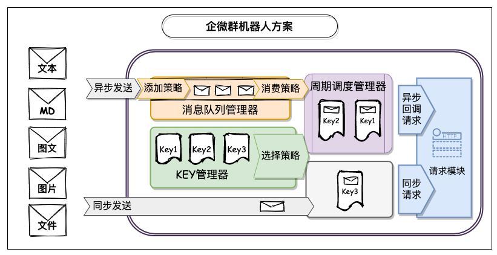

# 企业微信机器人

[](https://github.com/WesleyOne/qy-weixin-robot-spring-boot-starter/actions/workflows/codeql-analysis.yml) [](https://circleci.com/gh/WesleyOne/qy-weixin-robot-spring-boot-starter/tree/master) [](https://codecov.io/gh/WesleyOne/qy-weixin-robot-spring-boot-starter)  [](https://docs.oracle.com/javase/8/docs/index.html) 

> [企业微信群机器人API接口文档https://work.weixin.qq.com/api/doc/90000/90136/91770](https://work.weixin.qq.com/api/doc/90000/90136/91770)



> 官方限流规则：每个机器人发送的消息不能超过20条/分钟。为了更可靠方便地使用API，所以产出本项目。

**优🍻点**
- 🔥提供有效的**可靠方便**机器人消息发送处理方案
- 👏处理方案模块化，可根据需要自定义扩展组件
- 🤔支持SpringBoot和非SpringBoot项目
- 😉项目依赖少

# 快速入门

## 添加依赖

```xml
<dependency>
    <groupId>io.github.wesleyone</groupId>
    <artifactId>qy-weixin-robot-spring-boot-starter</artifactId>
    <version>2.0</version>
</dependency>
<!--springboot needed below-->
<dependency>
  <groupId>org.springframework.boot</groupId>
  <artifactId>spring-boot-starter</artifactId>
  <version>${spring.boot.version}</version>
</dependency>
```

## 认识消息类型对象

- 文本：`QyWeixinRobotTextMessage`
- Markdown：`QyWeixinRobotMarkdownMessage`
- 图片：`QyWeixinRobotImageMessage`
- 图文：`QyWeixinRobotNewsMessage`
- 文件：`QyWeixinRobotFileMessage`

## SpringBoot环境案例

**添加机器人**
```java
@SpringBootApplication
public class SpringApplicationStartUp {

  /**
   * 新建群对象
   */
  @Bean
  public QyWeixinRobotGroupBean groupABean() {
    // 传入机器人KEY参数值
    return new QyWeixinRobotGroupBean(Constant.KEY_LIST);
  }

  public static void main(String[] args) {
    final ApplicationContext context = SpringApplication.run(SpringApplicationStartUp.class, args);
    final QyWeixinRobotGroupBean groupABean = context.getBean("groupABean", QyWeixinRobotGroupBean.class);

    // 发送消息
    final QyWeixinRobotTextMessage textMessage
            = new QyWeixinRobotTextMessage("文本类型异步发送测试(推荐，防止被限流)");
    groupABean.send(textMessage);
  }
}
```

## 非SpringBoot环境案例

```java
public class NoneSpringApplicationStartUp {

  public static void main(String[] args) {
    // 新建群对象,传入机器人KEY参数值 
    QyWeixinRobotGroupClient groupClient
            = new QyWeixinRobotGroupClient(Constant.KEY_LIST);
    // 初始化
    groupClient.init();

    // 发送消息
    final QyWeixinRobotTextMessage textMessage
            = new QyWeixinRobotTextMessage("文本类型异步发送测试(推荐，防止被限流)");
    groupClient.send(textMessage);
  }
}
```

# 进阶操作

可通过自定义扩展点，覆盖默认配置。

- HTTP请求客户端
- 消息队列管理器
- KEY管理器  
- 调度管理器

> 参考DEMO
> `io.github.wesleyone.qy.weixin.robot.spring.bean.MyQyWeixinRobotConfiguration`

**自定义HTTP请求客户端**

HTTP请求客户端，是用来请求企业微信API接口。

```java
@Bean
@Primary
public QyWeixinRobotHttpClientComponent myQyWeixinRobotHttpClient() {
    OkHttpClient client = new OkHttpClient.Builder()
        .readTimeout(5, TimeUnit.SECONDS)
        .connectTimeout(5, TimeUnit.SECONDS)
        .writeTimeout(5, TimeUnit.SECONDS)
        .connectionPool(new ConnectionPool(5,5L,TimeUnit.MINUTES))
        .build();
    return new DefaultQyWeixinRobotRetrofit2HttpClientComponent(client);
}
```

<br>继续使用`DefaultQyWeixinRobotRetrofit2HttpClientComponent`对象，通过自定义`OkHttpClient`对象及配置，譬如连接超时、连接池等。
<br>或者继承`QyWeixinRobotHttpClientComponent`接口，完全实现接口方法。

**自定义消息队列管理器**

消息队列管理器。维护一个群的消息队列。为了防范限流，同时尽可能多的发送消息。
<br>特别注意，必须是多例的。

```java
@Bean
@Primary
public QyWeixinRobotQueueManagerFactoryBean myQueueManagerFactoryBean() {
    return new QyWeixinRobotQueueManagerFactoryBean(DefaultQyWeixinRobotQueueManagerComponent.class);
}
```

<br>自定义实现`QyWeixinRobotQueueManagerComponent`接口，实现接口方法
<br>传入以上自定义实现接口到`QyWeixinRobotQueueManagerFactoryBean`

**自定义KEY管理器**

KEY管理器。维护一个群里多个KEY。
<br>特别注意，必须是多例的。

```java
@Bean
@Primary
public QyWeixinRobotKeyManagerFactoryBean myKeyManagerFactoryBean() {
    return new QyWeixinRobotKeyManagerFactoryBean(DefaultQyWeixinRobotKeyManagerComponent.class);
}
```

<br>自定义实现`QyWeixinRobotKeyManagerComponent`接口，实现接口方法
<br>传入以上自定义实现接口到`QyWeixinRobotKeyManagerFactoryBean`

**自定义调度管理器**

调度管理器。用于周期性消费消息队列。
<br>默认配置用的单线程调度处理器。

```java
@Bean
@Primary
public QyWeixinRobotScheduledManagerComponent myQyWeixinRobotScheduledExecutorService() {
    final ScheduledExecutorService scheduledExecutorService = new ScheduledThreadPoolExecutor(1,
        new QyWeixinRobotThreadFactory("QY-WEIXIN-ROB-SCHEDULE-SPR-"));
    return new DefaultQyWeixinRobotScheduledManagerComponent(0,1,TimeUnit.SECONDS, true, scheduledExecutorService);
}
```

<br>继续使用`DefaultQyWeixinRobotScheduledManagerComponent`,
  1. 自定义`ScheduledExecutorService`,并指定核心线程数量、创建的子线程名称。
  2. 运行时参数配置。

    - `initialDelay` 首次运行延迟时长，默认5。
    - `delay` 运行间隔延迟时长，默认5。
    - `unit` 时长单位，默认秒。
    - `isAtFixedRate`
        - `true`: 默认值。使用`scheduleAtFixedRate` 按照上次执行开始时间加上延迟时间，来计算下次调度开始时间。（推荐，减少延迟）
        - `false`: 使用`scheduleWithFixedDelay` 按照本次执行结束时间加上延迟时间，来计算下次调度开始时间。

<br>或者继承`QyWeixinRobotScheduledManagerComponent`接口，完全实现接口方法。

# 特别鸣谢

- [square/retrofit2](https://github.com/square/retrofit) A type-safe HTTP client for Android and the JVM
- [alibaba/testable-mock](https://github.com/alibaba/testable-mock) 特立独行的轻量Mock工具
- [google/gson](https://github.com/google/gson) A Java serialization/deserialization library to convert Java Objects into JSON and back
