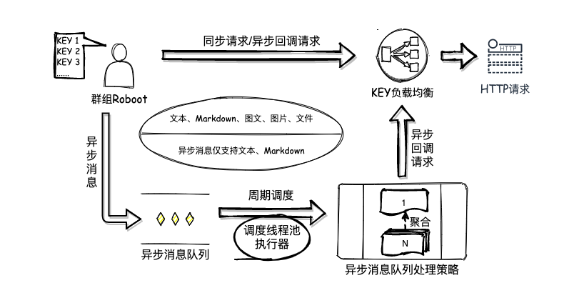

# 企业微信机器人

> [官方接口文档https://work.weixin.qq.com/api/doc/90000/90136/91770](https://work.weixin.qq.com/api/doc/90000/90136/91770)



# 快速入门

## 添加依赖

```xml
<dependency>
    <groupId>io.github.wesleyone</groupId>
    <artifactId>qy-weixin-robot-spring-boot-starter</artifactId>
    <version>1.0</version>
</dependency>
<!--springboot needed below-->
<dependency>
  <groupId>org.springframework.boot</groupId>
  <artifactId>spring-boot-starter</artifactId>
  <version>${spring.boot.version}</version>
</dependency>
```

## SpringBoot环境

**添加机器人**
```java
@Configuration
public class MyQyWeixinRobotConfiguration {
    @Bean
    public QyWeixinRobotBean robotA() {
        return new QyWeixinRobotBean("替换WEBHOOK链接的参数KEY值");
    }
}
```
**在业务类里注入机器人，并调用发送方法**
```java
@Component
public class BizBean {
  @Autowired
  private QyWeixinRobotBean robotA;
  
  public void postMsgAsync () {
    final QyWeixinTextMessage batchMessage
            = new QyWeixinTextMessage("文本类型异步发送测试-spring");
    robotA.postMsgAsyncQueue(batchMessage);
  }
}
```
**启动项目**
```java
@SpringBootApplication
public class SpringApplicationStartUp {

  public static void main(String[] args) {
    final ApplicationContext context = SpringApplication.run(SpringApplicationStartUp.class, args);
    final BizBean bizBean = context.getBean(BizBean.class);
    bizBean.postMsgAsync();
  }
}
```

## 非SpringBoot环境

实质上`QyWeixinRobotClient`是`QyWeixinRobotBean`的父类。

```java
public class NoneSpringApplicationStartUp {

    public static void main(String[] args) {
        QyWeixinRobotClient qyWeixinRobotClient
                = new QyWeixinRobotClient("webhookUrl");
        // 初始化
        qyWeixinRobotClient.init();

        // 异步发送(推荐，防止被限流)
        final QyWeixinTextMessage batchMessage
                = new QyWeixinTextMessage("文本类型异步发送测试");
        qyWeixinRobotClient.postMsgAsync(batchMessage);
    }
}
```

# 进阶操作

## 可扩展点
可通过自定义扩展点，覆盖默认配置。
> 参考DEMO
> `io.github.wesleyone.qy.weixin.robot.demo2.MyQyWeixinRobotConfiguration`

### 自定义Http请求客户端

Http请求客户端，是用来请求企业微信API接口。
<br>通过自定义`OkHttpClient`对象及配置，譬如连接超时等。
<br>传入`QyWeixinRobotHttpClient`对象。

```java
@Bean
@Primary
public QyWeixinRobotHttpClient myHttpClient() {
    OkHttpClient client = new OkHttpClient.Builder()
            .readTimeout(5, TimeUnit.SECONDS)
            .connectTimeout(5, TimeUnit.SECONDS)
            .writeTimeout(5, TimeUnit.SECONDS)
            .build();
    QyWeixinRobotHttpClient qyWeixinRobotHttpClient = new QyWeixinRobotHttpClient();
    qyWeixinRobotHttpClient.setClient(client);
    return qyWeixinRobotHttpClient;
}
```

### 自定义异步队列消息处理策略
异步队列消息处理策略，是为了防范限流，同时尽可能多的发送消息。

<br>自定义实现`QyWeixinQueueProcessStrategy`策略接口，
<br>完成添加消息`addProcess`、消费队列`consumeProcess`方法逻辑设计。
<br>也可以是调节默认实现`DefaultQyWeixinQueueProcessStrategy`的参数`maxBatchMsgCounts`一批处理最大消息数。

```java
@Bean
@Primary
public QyWeixinQueueProcessStrategy myQueueProcessStrategy() {
    final DefaultQyWeixinQueueProcessStrategy strategy
        = new DefaultQyWeixinQueueProcessStrategy();
        strategy.setMaxBatchMsgCounts(10);
    return strategy;
}
```

### 自定义调度线程池处理器
调度线程池处理器，用于周期性发起处理异步消息队列。
<br>默认配置用的单线程处理器。

1. 自定义`ScheduledExecutorService`,并指定核心线程数量、创建的子线程名称。
> ⚠️比如单个项目使用多个机器人时，应适当增大核心线程数;

2. 运行时参数配置。
- `initialDelay` 首次运行延迟时长，默认5。
- `delay` 运行间隔延迟时长，默认5。
- `unit` 时长单位，默认秒。
- `isAtFixedRate`
    - `true`: 默认值。使用`scheduleAtFixedRate` 按照上次执行开始时间加上延迟时间。（推荐，减少延迟）
    - `false`: 使用`scheduleWithFixedDelay` 按照本次执行结束时间加上延迟时间。

> ⚠️尤其是分布式项目下，一个机器人在多台机器上使用，要修改`delay`间隔时间，防止被限流。参考计算公式:`delay=3*机器数+1`。
> 
```java
@Bean
@Primary
public QyWeixinRobotScheduledExecutorService myScheduledExecutorService() {
    final ScheduledExecutorService scheduledExecutorService =
              Executors.newScheduledThreadPool(5,new QyWeixinRobotThreadFactoryImpl("qy-weixin-spring-"));
    return new QyWeixinRobotScheduledExecutorService(2,3,TimeUnit.SECONDS, true, scheduledExecutorService);
}
```
## 建议

一个项目里使用多个机器人时，注意如下：
- Http请求客户端对象复用。有利减少连接线程数，减少内存占用。
- 调度线程池执行器复用。提高池内线程利用率，减少内存占用。
- 自定义扩展的`init()`方法做好状态校验。防止多个机器人重复执行导致的异常。

> SpringBoot方式使用时，已采用以上建议。

# 特别鸣谢

- [square/retrofit2](https://github.com/square/retrofit) A type-safe HTTP client for Android and the JVM
- [alibaba/testable-mock](https://github.com/alibaba/testable-mock) 特立独行的轻量Mock工具
- [google/gson](https://github.com/google/gson) A Java serialization/deserialization library to convert Java Objects into JSON and back

